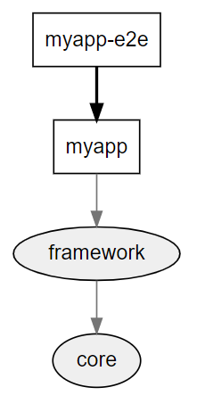

# App->Lib->Lib

# Monorepo-Betrieb

1. ``ng serve -o``
2. Etwas in libs ändern
3. Änderung erscheint sofort im Browser

# Lib-Betrieb

1. path-mappings in ``tsconfig.json`` auskommentieren (``ng serve`` hat keinen Parameter um eine eigene ``tsconfig.json`` anzugeben.)
2. ``ng build core``
3. ``npm pack dist\libs\core``
4. ``npm i myapp-core-0.0.1.tgz``
5. ``ng build framework``
6. ``npm pack dist\libs\framework``
7. ``npm i myapp-framework-0.0.1.tgz``
8. Weitere Änderung in Libs machen
9. ``ng serve -o``
10. Man sieht nun den Stand aus den Libraries ohne die Änderung aus dem letzten Schritt

# Zurück zu Monorepo

1. Path-Mappings wieder aktivieren
2. ``ng serve -o``
3. Man sieht nun den aktuellen Stand aus dem Monorepo inkl. der letzten Änderungen

